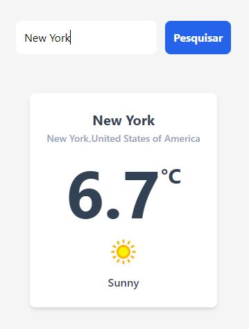

App simples de clima usando React JS, React Hook, Tailwind CSS e consumindo uma API externa

- [x] eslint 
- [x] funções assíncronas
- [x] eventos sintéticos
- [x] hooks
- [x] estilização e design responsivo usando tailwind css.

Weather API - https://www.weatherapi.com/

https://www.youtube.com/watch?v=O6fYg3-Kgx0

